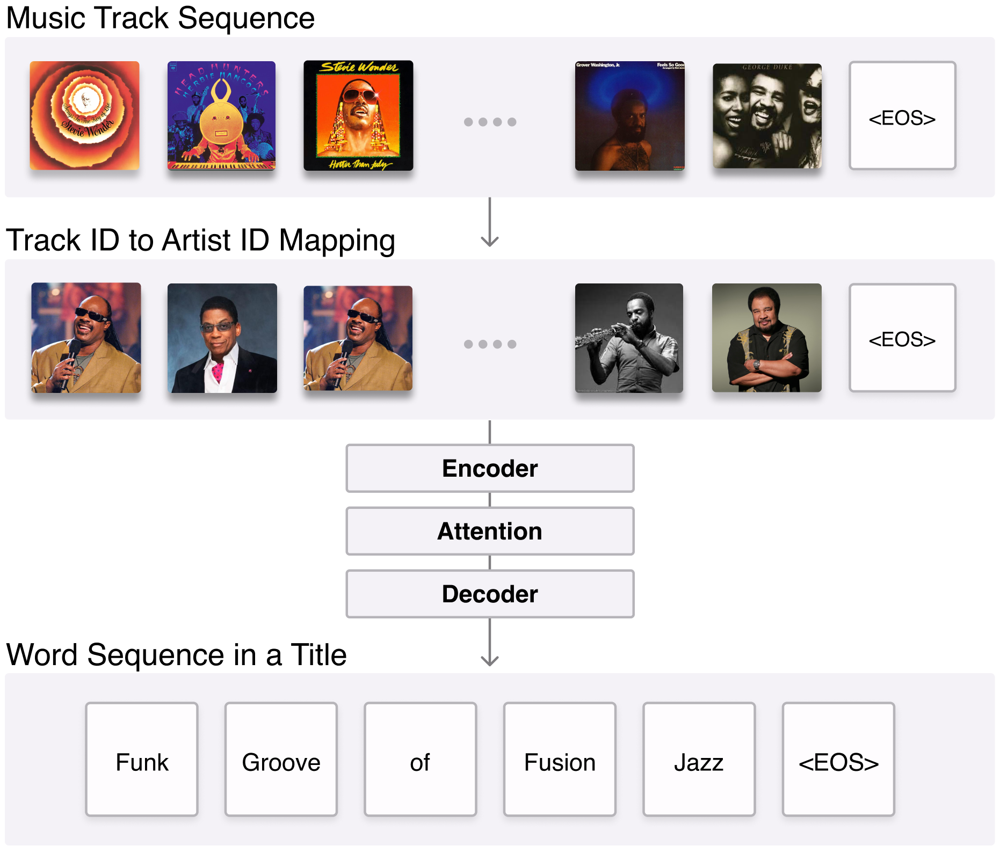

# Music Playlist Title Generation Using Artist Information

This repository provides the code for music playlist title generation model. For details, please refer to our paper **Music Playlist Title Generation Using Artist Information**. (This paper was accepted to [AAAI-23 Workshop on Creative AI Acorss Modalities](https://creativeai-ws.github.io/))




### Download Dataset

**Melon Playlist Dataset** : Download song_meta.json, test.json, train.json, and val.json from the [official Melon Playlist Dataset webpage](https://mtg.github.io/melon-playlist-dataset/) and place them in ``./dataset/melon/data`` as shown below. 

* dataset
    * melon
        * data
            * song_meta.json
            * test.json
            * train.json
            * val.json

**Million Playlist Dataset** : Download spotify_million_playlist_dataset.zip file from [this webpage](https://www.aicrowd.com/challenges/spotify-million-playlist-dataset-challenge/dataset_files) and unzip the file. Place mpd.slice.0-999.json, ..., mpd.slice.999000-999999.json in ``./dataset/million/data`` as shown below. 

* dataset
    * million
        * data
            * mpd.slice.0-999.json
            * .
            * .
            * .
            * mpd.slice.999000-999999.json


---------------------------------------

### Noise Filtering and Chronological Split
To filter out noisy data, as suggested in the section 3 of the paper, run the following code.

```sh
$ python preprocessing.py
```

We provide the following parameters.

- `--dataset`: to choose between the Melon Playlist Dataset and the Million Playlist Dataset. E.g. "melon", "million"

- `--dataset_dir`: to set the directory where the data is stored. Default:"./dataset"; (This means that the train, valid and test sets are stored in ``./dataset/{dataset_name}/sets`` and the tokenizers are stored in ``./dataset/{dataset_name}/tokenizer``

Run the following code to check statistics. (Figures are stored in ``./figure``.)

```sh
$ python statistics.py
```

---------------------------------------

### Train

To train the model on preprocessed training data, run the following code. (Models are stored in ``./checkpoint``.)

```sh
$ python train.py
```

- `--input_type`: "artist" for artist ID embedding and "track" for track ID embedding.

---------------------------------------

### Infer and Evaluate

Run the following code to draw inferences. Each case is evaluated with the following metrics: BLEU( $n$ =1,2 ), ROUGE( $n$ =1,2 ), METEOR, BERT Score and SBERT Score. Diversity is evaluated with distinct- $n$ ( $n$ =1,2,3 ). The result is saved in ``./inference/{checkpoint_name}``. 

```sh
$ python infer.py
```

Note : `test_file_name` is set to `test` by default, but set it to `highest_ft`, `lowest_ft`, `highest_fa`, `lowest_fa` to evaluate on the highest $F_t$ group, lowest $F_t$ group, highest $F_a$ group, and lowest $F_a$ group. (See the section 5 of the paper to get the definition of $F_t$ and $F_a$)


Run the following code to get the Negative Log-Likelihood(NLL) on the test set. The result is saved in ``./inference``.

```sh
$ python test.py
```

---------------------------------------
### Acknowledgements

This repository includes code from the following repositories with modifications:
* [Music Playlist Title Generation: A Machine Learning Approach](https://github.com/SeungHeonDoh/ply_title_gen)

* [Korean_BERT_Score](https://github.com/lovit/KoBERTScore)

---------------------------------------
## Paper

Please cite our paper if you use this code in your work:
```
@InProceedings{kim2023,
  itle={Music Playlist Title Generation Using Artist Information},
  author={Kim, Haven and Doh, Seungheon and Lee, Junwon and Nam, Juhan},
  journal={AAAI-23 workshop on Creative AI Across Modalities},
  year={2023}
}
```
